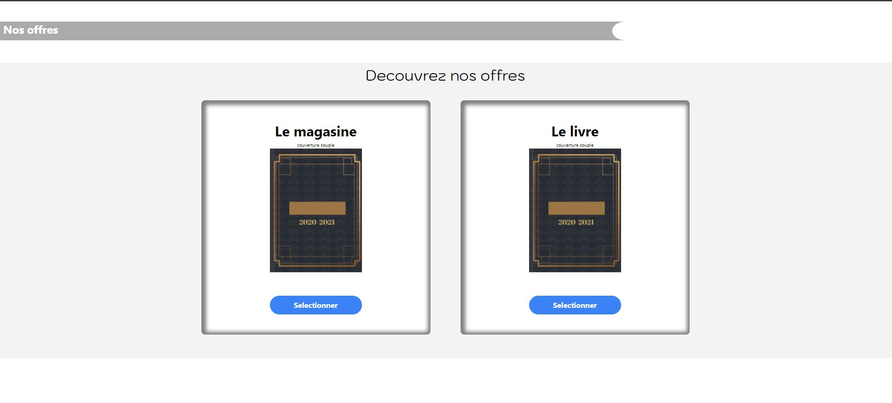

# **Projet TestOn**

## Présentation du projet TestOn

**TODO_1** : Réalisation de deux pages avec un menu qui permet de surfer sur ces pages.
**TODO_2** :Mise en place d'une ancre qui mène à la section des produits.
**TODO_3** :Les deux boutons permettent d'ouvrir une modal.
**TODO_4** :la modal permet de modifier la quantité et affiche le prix associé.

## Lien html

* [TestOn](https://melaniemdm.github.io/testOn/home.html)
